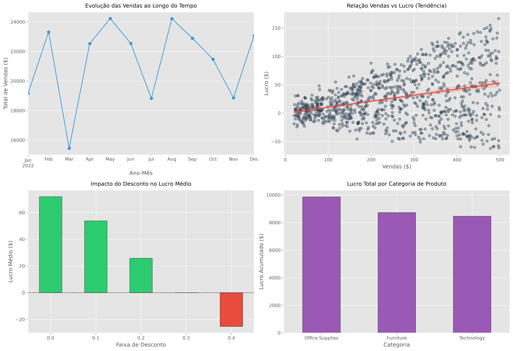

# Análise de Vendas e Lucratividade

## Objetivo
Analisar dados de vendas corporativas para identificar os principais fatores que impactam a lucratividade, com foco analítico no efeito destrutivo de descontos excessivos, performance de categorias e comportamento temporal da receita.

---

## Ferramentas e Bibliotecas
- **Linguagem:** Python 3.x
- **Manipulação de Dados:** Pandas
- **Visualização Estatística:** Matplotlib & Seaborn
- **Ambiente de Desenvolvimento:** GitHub Codespaces / Jupyter Notebook

---

## Escopo da Análise Eleita
- **Análise Temporal:** Evolução mensal das vendas para identificação de sazonalidade.
- **Análise de Correlação:** Dispersão e linha de tendência estatística entre Volume de Vendas e Lucro Líquido.
- **Análise de Elasticidade de Preço:** Impacto de faixas de desconto na margem média de lucro.
- **Segmentação por Categoria:** Identificação de gargalos de lucratividade por agrupamento de produtos.

---

## Principais Insights Analíticos
- **Descolamento de Receita e Margem:** O aumento no volume bruto de vendas não garante o crescimento do lucro operacional.
- **Efeito Destrutivo do Desconto:** Existe uma forte correlação negativa (-0.79) entre margem e desconto. Descontos elevados corroem agressivamente o lucro médio, tornando a operação deficitária a partir de determinadas faixas.
- **Assimetria de Categorias:** Algumas categorias de produtos apresentam performance inferior em lucratividade, demandando revisão urgente de mix ou precificação.

---

## Dashboard Consolidado

Abaixo está o painel visual unificado que valida as hipóteses de negócio levantadas. O gráfico de descontos destaca automaticamente em **vermelho** as faixas que geram prejuízo médio para a operação.



*Figura 1: Painel executivo unificado englobando evolução temporal, dispersão de receita, impacto de descontos e lucratividade por categoria.*

---

## Conclusão e Recomendações Estratégicas

A análise estatística comprovou que o crescimento nominal de vendas está desassociado da evolução do lucro devido a políticas agressivas de desconto. Políticas de descontos mal planejadas invertem a curva de margem, gerando prejuízo real mesmo com alta volumetria.

**Recomendações:**
1. **Revisão de Trade Policy:** Implementar travas de segurança no sistema para limitar descontos automáticos nas faixas críticas detectadas em vermelho.
2. **Reprecificação do Mix:** Auditar os custos e margens das categorias com desempenho inferior para reestruturar suas margens de contribuição.
3. **Foco em Eficiência:** Substituir a meta exclusiva de "Volume de Vendas (Sales)" por metas atreladas à "Margem de Contribuição (Profit)".

---

## Como Executar o Projeto

Este projeto está estruturado de forma portátil e otimizado para rodar em ambientes de nuvem como o **GitHub Codespaces**.

1. Instale as dependências contidas no arquivo de governança:
   ```bash
   pip install -r requirements.txt
   ```

2. Abra o arquivo de análise localizado na pasta correta:
   ```text
   notebook/analise.ipynb
   ```

3. Execute as células de forma linear (de cima para baixo) para gerar e exportar o dashboard atualizado.
